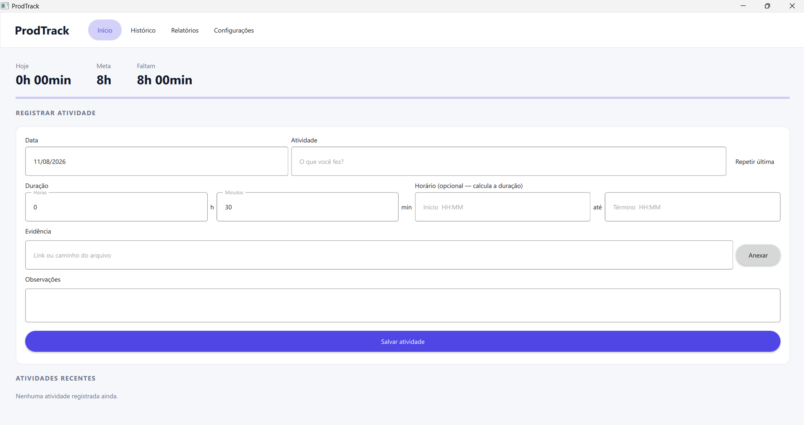
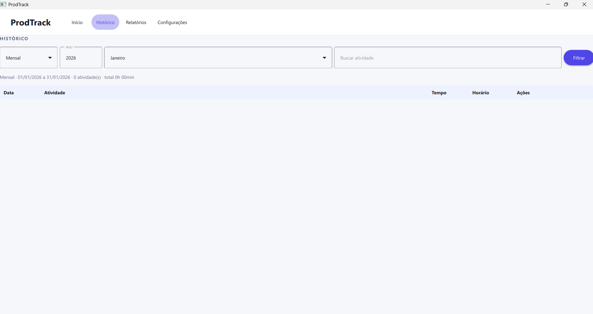
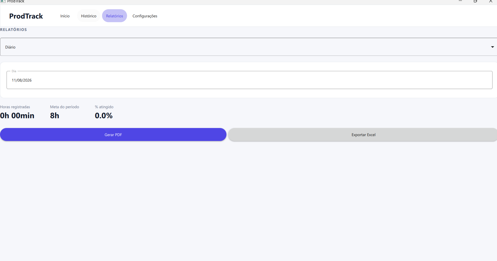
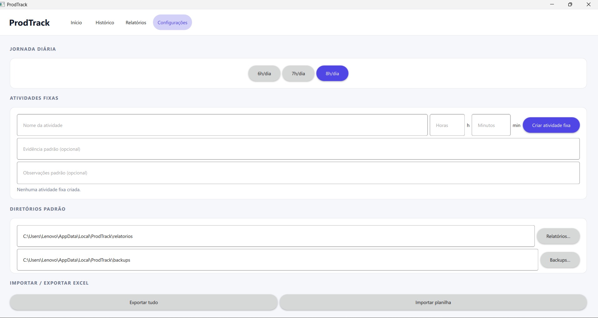

# ProdTrack

<p align="center">
  <strong>Fast, organized work activity tracking.</strong><br>
  A local desktop application for tracking hours, schedules, evidence, history, and reports without relying on a browser or server.
</p>

---

## Overview

ProdTrack is a desktop application for recording and reviewing remote-work activities. Its primary workflow is designed to take only a few seconds: describe the activity, enter its duration or start and end times, attach evidence when needed, and save the record.

The product works entirely on the user's computer and is designed for a single user. Its SQLite database, backups, and generated reports remain local, with no account, server, or mandatory synchronization.

## Core capabilities

- **Fast activity entry** — record the date, activity, duration, schedule, evidence, and notes from one focused form.
- **Flexible time input** — enter a duration in hours and minutes or provide start and end times for automatic calculation.
- **Daily progress** — review recorded hours, the daily target, remaining time, and overall completion.
- **Pinned activities** — create reusable personal templates with a default name, duration, evidence, and notes.
- **Repeat last activity** — reuse the most recent activity and change only what is different.
- **Period-based history** — browse custom, monthly, quarterly, and half-year views with activity search.
- **Record management** — edit, duplicate, or delete activities from the Dashboard and History pages.
- **Professional reports** — generate daily, monthly, quarterly, and half-year PDF reports with summaries and activity details.
- **Excel integration** — import spreadsheets, export selected periods, or create a complete history export.
- **Local backups** — create automatic and manual database backups and restore them directly from the application.
- **Personal settings** — configure the daily workload, report and backup directories, and pinned activities.

## Application pages

| Page | Purpose |
| --- | --- |
| **Dashboard** | Daily summary, pinned activities, quick-entry form, and recent activities. |
| **History** | Search, custom ranges, and monthly, quarterly, or half-year views. |
| **Reports** | PDF generation and Excel export for the selected period. |
| **Settings** | Workload, pinned activities, directories, Excel operations, and backups. |

## Screenshots

### Dashboard



### History



### Reports



### Settings



## Pinned activities

Pinned activities are reusable templates created by the user. Each template can store:

- an activity name;
- a default duration in hours and minutes;
- optional default evidence;
- optional default notes.

After a template is created in Settings, it appears on the Dashboard. Selecting it fills the activity form while keeping every field available for review before the record is saved.

## Time tracking

Activities can be recorded in either of two ways:

- enter a duration directly, such as `2h 30min`;
- enter start and end times, such as `08:15` to `10:45`.

When both times are provided, ProdTrack calculates the duration automatically. Overnight activities are supported, and start and end times are preserved in History, PDF reports, and Excel exports.

## Data import

ProdTrack accepts Excel spreadsheets with the following columns:

| Date | Activity | Start | End | Minutes | Evidence | Notes |
| --- | --- | --- | --- | ---: | --- | --- |
| 2026-08-11 | Weekly review meeting | 09:00 | 10:00 | 60 | https://example.com | Weekly agenda |

`Date`, `Activity`, and `Minutes` are required. Equivalent labels such as “Activity name” and “Time spent” are also recognized. Start, end, evidence, and notes are optional.

## Storage and backups

- During development, the `database.db` file is stored in the project directory.
- In the installed application, user data is stored in `%LOCALAPPDATA%\ProdTrack`.
- An automatic backup is created once per day when the application starts.
- The 30 most recent backups are retained by default.
- Uninstalling the application removes its binaries but preserves user data.
- Backup and report directories can be changed from Settings.

## Technology stack

| Area | Technologies |
| --- | --- |
| Desktop application | Python, PySide6, Qt Quick, and QML |
| Local data | SQLite and pandas |
| Spreadsheets | pandas and openpyxl |
| PDF reports | ReportLab |
| Windows distribution | PyInstaller and NSIS |

## Architecture

```text
ProdTrack
├── main.py                  Qt initialization and application entry point
├── database.py              SQLite connection and schema migrations
├── models.py                Business rules, queries, and CRUD operations
├── qml/
│   ├── Main.qml             Navigation and primary application pages
│   └── ActivityDialog.qml   Activity editing dialog
├── ui/
│   └── app_controller.py    Bridge between QML, business rules, and services
├── services/
│   ├── backup_service.py    Backup creation, retention, and restoration
│   ├── excel_service.py     Spreadsheet import and export
│   └── report_generator.py  PDF report generation
├── docs/screenshots/        README screenshot assets
├── installer/
│   └── ProdTrack.nsi        Windows installer definition
├── ProdTrack.spec           PyInstaller bundle configuration
└── build_installer.ps1      Executable and installer build automation
```

The QML interface communicates exclusively with the PySide6 controller. The controller validates input and calls either `models.py` or a specialized service, while direct SQLite access remains isolated in the data layer.

## Running from source

Requirements:

- Python 3.12 or newer;
- pip.

```powershell
python -m venv venv
venv\Scripts\activate
pip install -r requirements.txt
python main.py
```

## Windows distribution

End users should install ProdTrack through the Windows installer and do not need to configure Python or SQLite. To create a new distribution build:

```powershell
powershell -ExecutionPolicy Bypass -File .\build_installer.ps1
```

The build process creates:

- `dist/ProdTrack/` — the standalone application bundle;
- `release/ProdTrack-Setup-1.0.0.exe` — the Windows installer with shortcuts and an uninstaller.

The current installer is not digitally signed. Windows SmartScreen may display a warning until a trusted Authenticode certificate is added to the release workflow.

## Product direction

ProdTrack is evolving as a focused personal productivity tool: fast enough for everyday activity entry, clear enough for reviewing work history, and dependable when evidence and formal reports are required.

## Author

**Arthur Florencio Afonso**<br>
[GitHub](https://github.com/arthurflorencio) · [LinkedIn](https://www.linkedin.com/in/arthur-florencio-afonso/)
